# Jenkins CI/CD Pipeline for Flask Application

## Project Overview:

This project demonstrates a complete Continuous Integration and Continuous Deployment (CI/CD) pipeline for a Flask-based Python web application using Jenkins.

The pipeline automates the following tasks:

* Source Code Checkout from GitHub
* Dependency Installation
* Unit Testing using Pytest
* Docker Image Build
* Docker Image Deployment
* Automatic Trigger using GitHub Webhook
* Email Notification on Build Success/Failure

---

# Project Architecture

```
Developer
    │
    │ git push
    ▼
GitHub Repository
    │
    │ Webhook
    ▼
Jenkins (Docker Container)
    │
    ├── Checkout Source Code
    ├── Install Dependencies
    ├── Run Unit Tests
    ├── Build Docker Image
    ├── Deploy Docker Container
    └── Send Email Notification
    │
    ▼
Flask Application
```

---

# Technologies Used

| Technology    | Purpose                |
| ------------- | ---------------------- |
| Python 3      | Application Runtime    |
| Flask         | Web Framework          |
| Pytest        | Unit Testing           |
| MongoDB Atlas | Database               |
| Docker        | Containerization       |
| Jenkins       | CI/CD Automation       |
| GitHub        | Source Code Repository |
| ngrok         | Expose Local Jenkins   |
| Git           | Version Control        |

---

# Project Structure

```
.
├── app.py
├── Dockerfile
├── Jenkinsfile
├── requirements.txt
├── test_app.py
├── screenshots
├── start_flask.sh
├── templates
│   ├── add_student.html
│   ├── base.html
│   ├── index.html
│   └── update_student.html
├── README.md
└── LICENSE
```

---

# Prerequisites

Install the following:

* Docker Desktop
* Jenkins (Docker Container)
* Git
* Python 3
* MongoDB Atlas Account
* GitHub Account
* ngrok

---

# Jenkins Setup

## Pull Jenkins Image

```bash
docker pull jenkins/jenkins:lts
```

---

## Create Jenkins Volume

```bash
docker volume create jenkins_home
```

---

## Run Jenkins Container

```bash
docker run -d \
--name jenkins \
-p 8080:8080 \
-p 50000:50000 \
-v jenkins_home:/var/jenkins_home \
-v /var/run/docker.sock:/var/run/docker.sock \
jenkins/jenkins:lts
```

---

## Access Jenkins

```
http://localhost:8080
```

---

# Install Required Jenkins Plugins

* Git
* Docker Pipeline
* Pipeline
* GitHub
* Email Extension
* Credentials Binding

---

# Install Required Packages inside Jenkins Container

Enter Jenkins container

```bash
docker exec -it jenkins bash
```

Update packages

```bash
apt update
```

Install Python

```bash
apt install -y python3 python3-pip python3-venv
```

Verify

```bash
python3 --version
pip3 --version
```

---

# Configure Docker in Jenkins

Install Docker CLI inside Jenkins container.

Verify Docker:

```bash
docker version
```

---


# Configuring the Jenkins Pipeline

Follow the below steps to configure the Jenkins Pipeline:

### Step 1: Create a New Pipeline Job
1. Open **Jenkins Dashboard**.
2. Click **New Item**.
3. Enter a job name (e.g., `ahamed-flask-ci-cd`).
4. Select **Pipeline**.
5. Click **OK**.

---

### Step 2: Configure GitHub Repository
1. Open the created pipeline job.
2. Click **Configure**.
3. Scroll down to the **Pipeline** section.
4. Select:
   - **Definition:** `Pipeline script from SCM`
   - **SCM:** `Git`
5. In the **Repository URL**, enter your GitHub repository URL.

Example:

```text
https://github.com/ahamedkhany/flask_Practice.git
```

6. If the repository is private, add GitHub credentials. (Skip for public repositories.)
7. Set the **Branch Specifier**:

```text
*/main
```

---

### Step 3: Configure the Jenkinsfile
Under the **Pipeline** section:

- **Script Path:**

```text
Jenkinsfile
```

(Keep this value unless the Jenkinsfile is inside another folder.)

---

### Step 4: Enable Automatic Builds
Under **Build Triggers**, enable:

```text
✔ GitHub hook trigger for GITScm polling
```

This allows Jenkins to automatically start a new build whenever code is pushed to the GitHub repository.

---

#### Jenkins pipeline configuration screenshot1

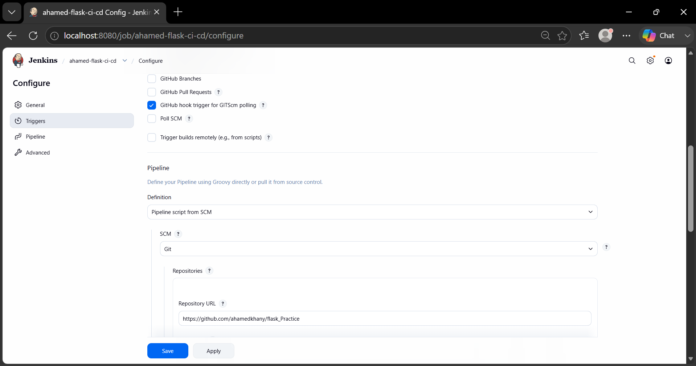


#### Jenkins pipeline configuration screenshot2

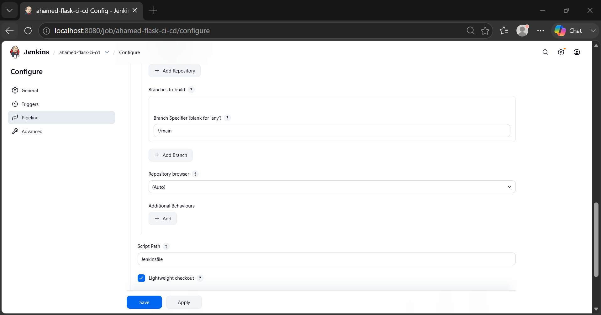


---


### Step 5: Save the Configuration
Click **Save**.

The pipeline is now configured and ready to execute.

---

### Step 6: Run the Pipeline
- Click **Build Now** to trigger the first build manually for local testing.
- After configuring the GitHub webhook, every push to the `main` branch will automatically trigger a new Jenkins build.


---


# Jenkins Credentials

Create the following credentials.

## Secret Text

ID

```
mongo-uri
```

Value

```
MongoDB Atlas Connection String
```

---

## Secret Text

ID

```
secret-key
```

Value

```
Flask Secret Key
```

### Credentials configured (Environment variables included)

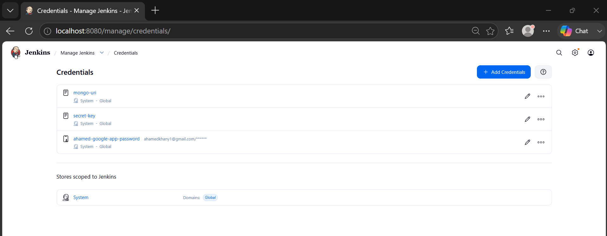

---


# Clone Repository

```bash
git clone <your-github-fork-url>
```


---


# Jenkinsfile creation with following stages:

## Stage 1

Checkout Source Code

```
checkout scm
```

Downloads the latest code from GitHub.

---

## Stage 2

Install Dependencies

```
python3 -m venv venv

source venv/bin/activate

pip install -r requirements.txt
```

---

## Stage 3

Run Unit Tests

```
pytest -v
```

The pipeline stops immediately if any test fails.

---

## Stage 4

Build Docker Image

```
docker build -t flask-app .
```

---

## Stage 5

Deploy Docker Container

Stop old container

```bash
docker rm -f flask-container
```

Run new container

```bash
docker run -d \
--name flask-container \
-p 5000:5000 \
flask-app
```

---

## Stage 6

Email Notification

Email notifications are sent automatically for

* Successful Builds
* Failed Builds


---


# ngrok Setup

Download ngrok using Microsoft store.

Authenticate

```bash
ngrok config add-authtoken <YOUR_AUTH_TOKEN>
```

Expose Jenkins

```bash
ngrok http 8080
```

Copy the generated HTTPS URL into GitHub Webhooks.

---


# GitHub Webhook Configuration

Repository

```
Settings

↓

Webhooks

↓

Add Webhook
```

Payload URL

```
https://<ngrok-url>/github-webhook/
```

Content Type

```
application/json
```

Events

```
Just the push event
```

### Webhook Cofiguration - Settings in Github

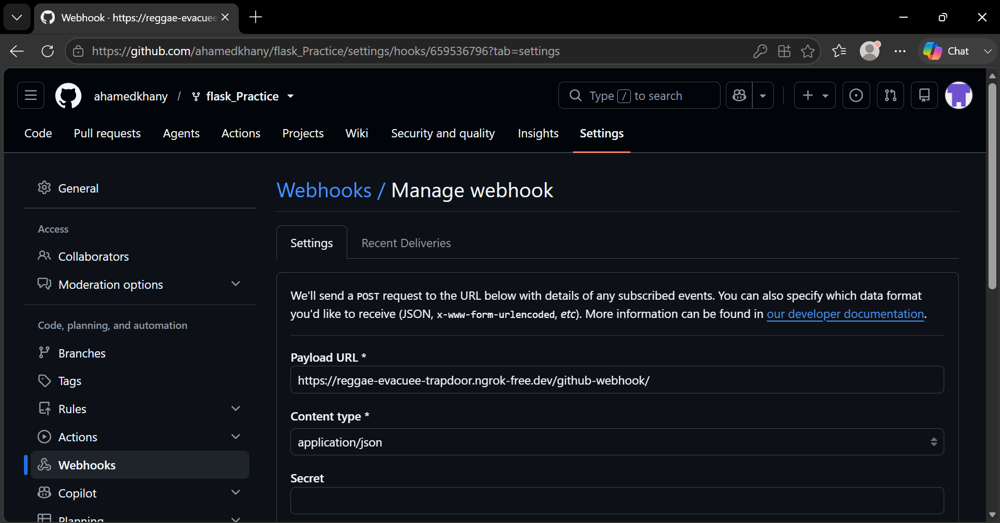


### Webhook Cofiguration - Delivery in Github

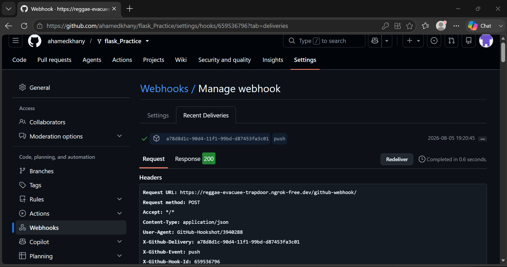


---


# Email Notifications

To receive email notifications for every successful or failed pipeline execution, Jenkins Email Extension Plugin was configured with Gmail SMTP.

### Prerequisites

* Install the following Jenkins plugins:

  * Email Extension Plugin
  * Mailer Plugin
* Enable **2-Step Verification** on the Gmail account.
* Generate a **Google App Password** from the Google Account security settings.
* Configure SMTP settings in **Manage Jenkins → System → Extended E-mail Notification**.

### SMTP Configuration

| Setting        | Value                                |
| -------------- | ------------------------------------ |
| SMTP Server    | smtp.gmail.com                       |
| SMTP Port      | 587                                  |
| Authentication | Gmail Username + Google App Password |
| Security       | TLS Enabled                          |

### Jenkins Credentials

The following credentials were added securely in Jenkins:

| Credential ID | Purpose                      |
| ------------- | ---------------------------- |
| `gmail-smtp`  | Gmail SMTP authentication    |
| `mongo-uri`   | MongoDB connection string    |
| `secret-key`  | Flask application secret key |

Sensitive information is stored using Jenkins Credentials and is not hardcoded in the repository.


---


# Testing the CI/CD Pipeline

After all the configurations and code setup completed.

#### Step 1: Commit and push your code changes to your repo.

#### Step 2: Automatically build should be triggered in Jenkins, since we have configured webhook in Github to access the Jenkins to trigger the build.

#### Step 3: Verify if all the build stages got passed.

#### Step 4: Check if the container is up and running using 'docker ps' command.

#### Step 5: Go to browser and run the aplication using url: http://localhost:5000

#### Step 6: Verify if notification is sent your email.

---


## Test 1: Verify Successful Pipeline


### Jenkins Dashboard of the latest build.

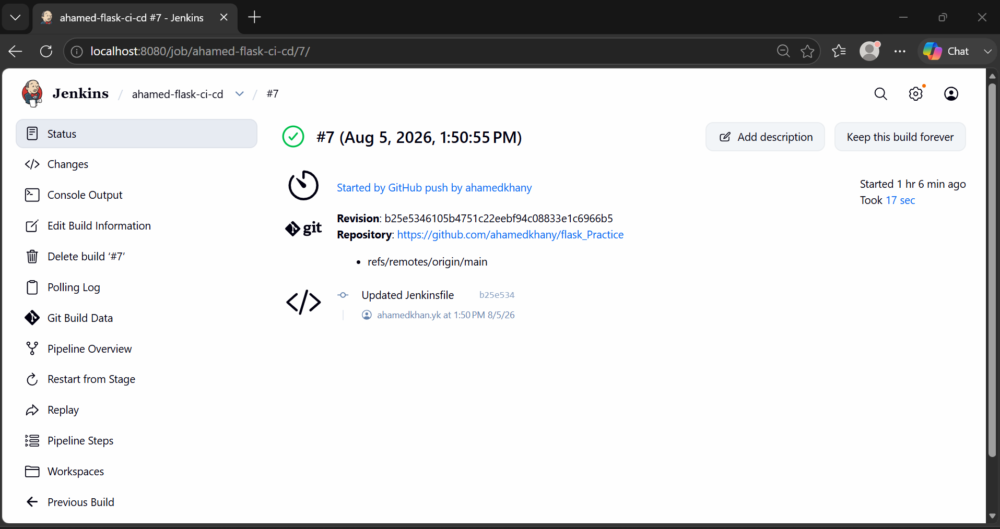


### Pipeline build log for Unit Tests

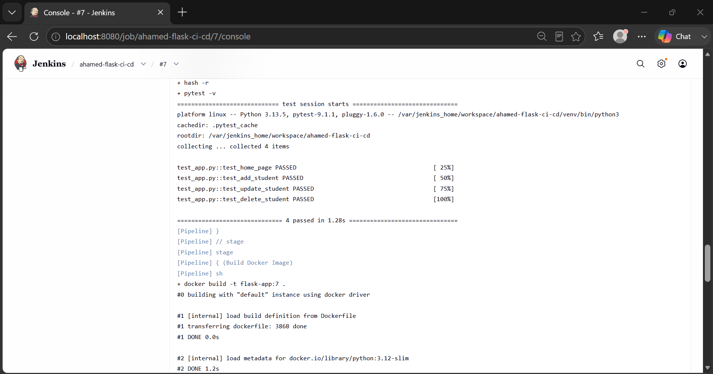


### Pipeline build Success log

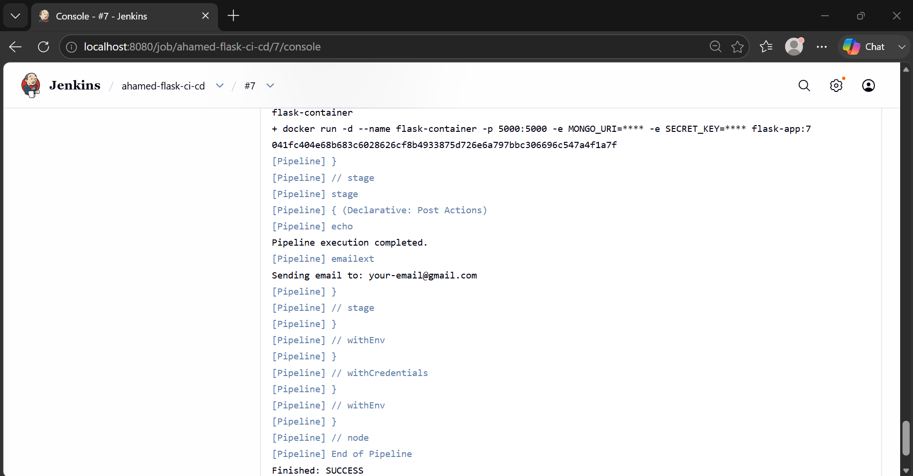


### Pipeline Stages passed

1.

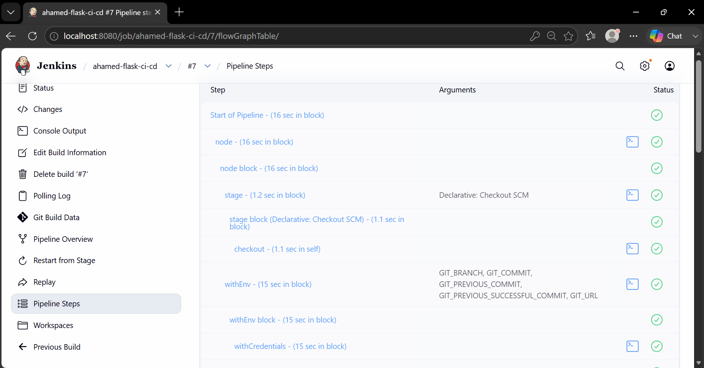

2.

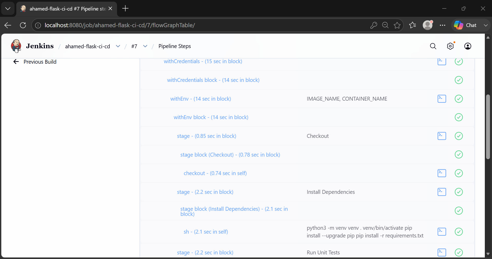

3.

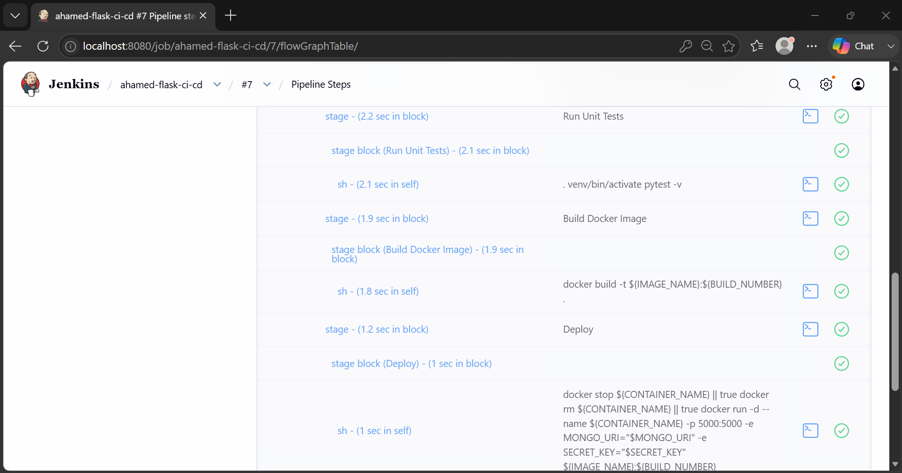

4.

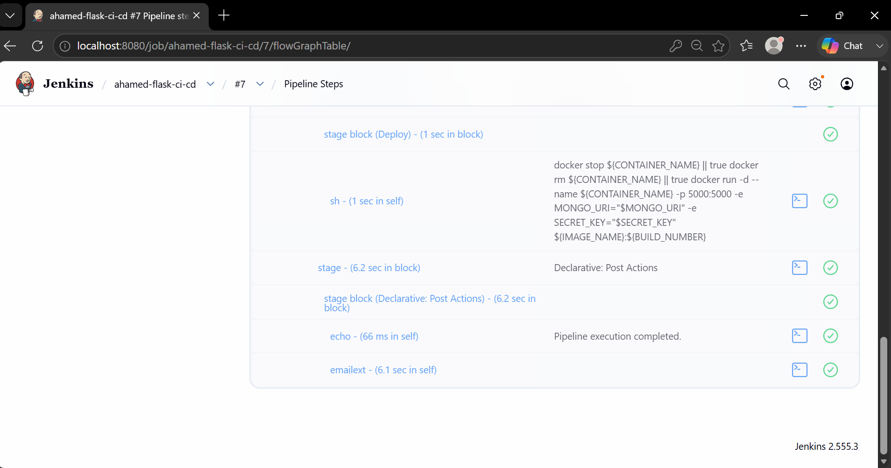


### Jenkins Webhook Log

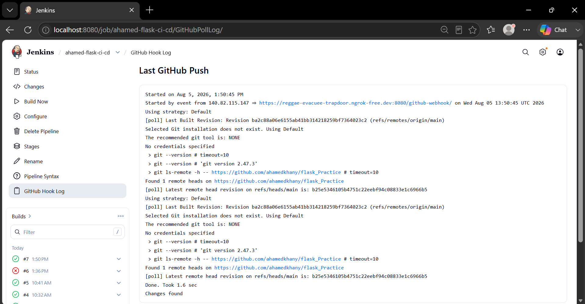


### Notification email

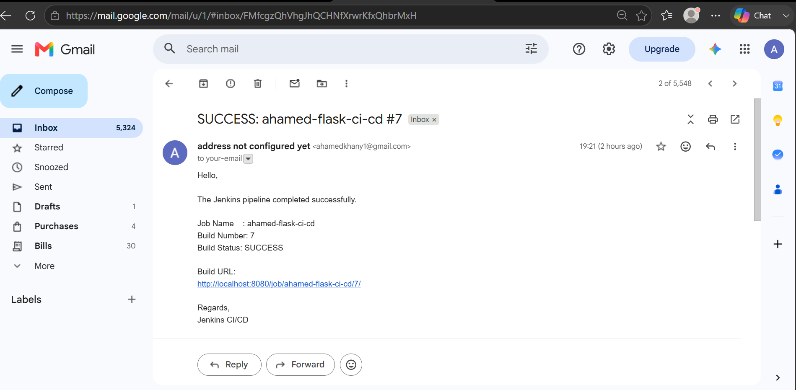


---


## Test 2: Verify Flask Application


### Verify in Docker if the container is up and running.

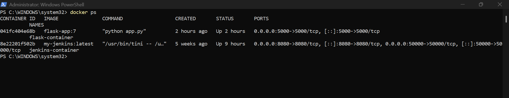


### Verify in Browser

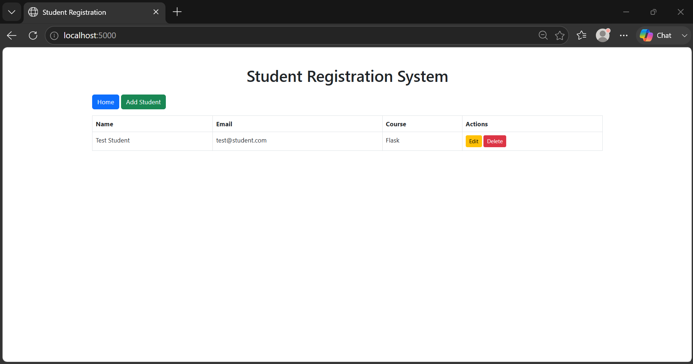


---


---

# Expected Pipeline Execution Flow

```text
Developer
     │
     │ git push
     ▼
GitHub Repository
     │
     │ Webhook
     ▼
Jenkins Pipeline
     │
     ├── Checkout Source Code
     ├── Install Dependencies
     ├── Run Unit Tests
     ├── Build Docker Image
     ├── Deploy Docker Container
     └── Send Email Notification
     │
     ▼
Flask Application Running Successfully
```


---

# Screenshots

Include the following screenshots in the repository:

* Jenkins Dashboard
* Jenkins Pipeline Stages
* Successful Build
* Failed Build
* GitHub Webhook Configuration
* ngrok Tunnel
* Running Flask Application
* Docker Containers
* Jenkins Console Output

---

# Repository

Forked Repository:

```
https://github.com/<your-username>/flask_Practice
```

---

# Conclusion

This project demonstrates the implementation of a complete CI/CD pipeline using Jenkins for a Flask web application. The pipeline automatically checks out code from GitHub, installs dependencies, executes unit tests, builds a Docker image, deploys the application as a Docker container, and sends build notifications. GitHub Webhooks and ngrok are used to automate pipeline execution on every push to the main branch.
