# GitHub Actions CI/CD Pipeline for Flask Application

## 1. Project Overview

This project implements a CI/CD pipeline for a Python Flask application using **GitHub Actions**.

The pipeline automatically:

* Installs Python dependencies
* Runs unit tests using `pytest`
* Builds a Docker image
* Pushes the Docker image to **Amazon Elastic Container Registry (ECR)**
* Deploys the application to a **staging environment**
* Deploys the application to **production** when a release tag is created
* Uses GitHub Environments and Secrets to manage environment-specific configuration
* Uses AWS EC2 instances for running the Docker containers

### CI/CD Architecture

```text
Developer
    |
    | git push
    v
GitHub Repository
    |
    +--------------------+
    |                    |
    v                    v
 staging               main
    |                    |
    |                    |
    v                    |
GitHub Actions            |
    |                    |
    | CI                  | CI
    |                    |
    v                    v
Install Dependencies   Install Dependencies
    |                    |
    v                    v
Run Tests             Run Tests
    |                    |
    v                    v
Build Docker Image    Build Docker Image
    |                    |
    v                    |
Push Image to ECR <-----+
    |
    +-----------------------------+
    |                             |
    v                             v
Staging Deployment          Production Release
    |                       Tag: v1.0.0
    v                             |
EC2 Staging                       v
Container                    Production Approval
    |                             |
    v                             v
Port 5001                  EC2 Production
                                  |
                                  v
                           Flask Container
                           Port 5002
```

---

# 2. Technologies Used

* Python 3.12
* Flask
* PyMongo
* pytest
* Docker
* GitHub Actions
* Amazon ECR
* Amazon EC2
* GitHub Secrets
* GitHub Environments

---

# 3. Repository Structure

The repository contains the Flask application and GitHub Actions workflow.

```text
flask_Practice/
│
├── .github/
│   └── workflows/
│       ├── flask-ci-cd.yml
│       ├── securegate.yaml
│       └── summary.yaml
│
├── app.py
├── test_app.py
├── requirements.txt
├── Dockerfile
├── start_flask.sh
├── templates/
│   ├── add_student.html
│   ├── base.html
│   ├── index.html
│   └── update_student.html
│
├── Jenkinsfile
└── README.md
```

The existing `securegate.yaml` and `summary.yaml` workflows are separate workflows and are not part of this Flask CI/CD pipeline.

The existing `Jenkinsfile` is also independent from the GitHub Actions workflow.

---

# 4. Branch Strategy

Two branches are maintained:

```text
main
staging
```

### Staging Branch

The `staging` branch is used for testing changes before production.

A push to `staging` triggers:

```text
Checkout
    ↓
Setup Python
    ↓
Install Dependencies
    ↓
Run Unit Tests
    ↓
Build Docker Image
    ↓
Push Image to Amazon ECR
    ↓
Deploy to Staging EC2
```

### Main Branch

The `main` branch represents production-ready code.

A normal push to `main` performs CI/build activities.

Production deployment is performed when a release tag is created from the production-ready `main` branch.

---

# 5. GitHub Actions Workflow

The workflow file is located at:

```text
.github/workflows/flask-ci-cd.yml
```

The workflow contains the following major stages/jobs:

```text
Build and Test
      ↓
Build and Push Docker Image
      ↓
Deploy to Staging / Deploy to Production
```

Deployment jobs use conditions so that staging and production are not deployed for every workflow execution.

---

# 6. CI Pipeline

The CI pipeline runs on GitHub-hosted Ubuntu runners.

## Step 1: Checkout Source Code

GitHub Actions checks out the source code:

```yaml
- name: Checkout Source Code
  uses: actions/checkout@v4
```

---

## Step 2: Setup Python

Python 3.12 is installed using:

```yaml
- name: Setup Python
  uses: actions/setup-python@v5
  with:
    python-version: "3.12"
```

---

## Step 3: Install Dependencies

Project dependencies are installed using:

```bash
python -m pip install --upgrade pip
pip install -r requirements.txt
```

---

## Step 4: Run Unit Tests

The test suite is executed using pytest:

```bash
pytest -v
```

MongoDB connection information and the Flask secret key are provided through GitHub Secrets.

The Docker image is built only after the tests pass.

---

# 7. Docker Image

The Flask application is packaged as a Docker image.

The image name used for this project is:

```text
flask-app
```

The Docker image is tagged using the GitHub commit SHA so that each build has a unique and traceable image.

Example:

```text
flask-app:<github-sha>
```

---

# 8. Amazon ECR

Amazon Elastic Container Registry (ECR) is used as the Docker image registry.

### AWS Region

```text
us-east-1
```

### ECR Repository

```text
flask-app
```

### ECR Registry

```text
533612070969.dkr.ecr.us-east-1.amazonaws.com
```

The complete Docker image path is therefore:

```text
533612070969.dkr.ecr.us-east-1.amazonaws.com/flask-app:<image-tag>
```

GitHub Actions authenticates with AWS and pushes the Docker image to ECR.

---

# 9. AWS IAM Configuration

An IAM user was configured for GitHub Actions to access AWS resources.

The required AWS access credentials are stored in GitHub Secrets and are not committed to the repository.

The EC2 instance was also created with an IAM role that provides the required ECR permissions.

This allows the EC2 instance to authenticate with Amazon ECR without storing AWS credentials directly on the EC2 server.

---

# 10. EC2 Configuration

An Ubuntu EC2 instance is used to run the Flask Docker containers.

Docker was installed on the EC2 instance.

The Ubuntu user was also added to the Docker group:

```bash
sudo usermod -aG docker ubuntu
```

This allows the `ubuntu` user to run Docker commands without requiring `sudo` after logging in again.

---

# 11. Staging Deployment

When code is pushed to the `staging` branch, the staging deployment job runs.

The Docker image is pulled from ECR and deployed to the staging EC2 environment.

The staging container is named:

```text
flask-app-staging
```

The container uses Flask's internal port:

```text
5000
```

and maps it to EC2 host port:

```text
5001
```

Therefore:

```text
EC2 Port 5001 → Docker Port 5000
```

The application can be tested using:

```text
http://<EC2_PUBLIC_IP>:5001
```

---

# 12. Production Deployment

Production deployment is intentionally separated from normal branch pushes.

Production deployment occurs when a release tag is created from the production-ready `main` branch.

Example:

```bash
git checkout main
git pull origin main

git tag v1.0.0
git push origin v1.0.0
```

The production workflow detects tags beginning with:

```text
v
```

For example:

```text
v1.0.0
v1.1.0
v2.0.0
```

---

# 13. GitHub Production Environment

A GitHub Environment named:

```text
production
```

is configured for the production deployment.

The production environment can be configured with required reviewers so that production deployment requires manual approval.

The production job uses:

```yaml
environment:
  name: production
```

This provides an additional protection layer before deploying to production.

---

# 14. Production Container

The production container is separate from the staging container.

Production container name:

```text
flask-app-production
```

The container internally listens on:

```text
5000
```

The EC2 host maps it to:

```text
5002
```

Therefore:

```text
EC2 Port 5002 → Docker Port 5000
```

The production application can be tested using:

```text
http://<EC2_PUBLIC_IP>:5002
```

Staging and production can therefore run independently on the same EC2 instance.

```text
EC2
│
├── flask-app-staging
│      5001 → 5000
│
└── flask-app-production
       5002 → 5000
```

---

# 15. GitHub Environments

Two GitHub Environments are configured:

```text
staging
production
```

Environment-specific secrets can be configured under:

```text
GitHub
→ Settings
→ Environments
→ staging / production
```

This allows deployment credentials and application configuration to be managed separately.

---

# 16. GitHub Secrets

Sensitive information is stored using GitHub Secrets.

The following values are used by the workflow.

| Secret                  | Purpose                   |
| ----------------------- | ------------------------- |
| `AWS_ACCESS_KEY_ID`     | AWS authentication        |
| `AWS_SECRET_ACCESS_KEY` | AWS authentication        |
| `AWS_REGION`            | AWS region                |
| `ECR_REGISTRY`          | Amazon ECR registry URL   |
| `ECR_REPOSITORY`        | ECR repository name       |
| `MONGO_URI`             | MongoDB connection string |
| `SECRET_KEY`            | Flask application secret  |
| `EC2_HOST`              | EC2 public IP/hostname    |
| `EC2_USER`              | EC2 SSH username          |
| `EC2_SSH_KEY`           | EC2 SSH private key       |

### Important

Secrets must never be committed to Git.

Do not place the following directly in:

* `README.md`
* `flask-ci-cd.yml`
* `Dockerfile`
* Python source code

Use GitHub Secrets instead.

---

# 17. ECR Secret Values

The ECR configuration follows this format:

```text
AWS_REGION
    us-east-1

ECR_REPOSITORY
    flask-app

ECR_REGISTRY
    533612070969.dkr.ecr.us-east-1.amazonaws.com
```

`ECR_REGISTRY` contains only the registry URL.

`ECR_REPOSITORY` contains only the repository name.

The workflow combines them:

```text
ECR_REGISTRY/ECR_REPOSITORY
```

Result:

```text
533612070969.dkr.ecr.us-east-1.amazonaws.com/flask-app
```

---

# 18. CI/CD Trigger Conditions

The workflow supports the following events.

### Push to staging

```text
git push origin staging
```

Triggers:

```text
CI
↓
Build
↓
ECR
↓
Staging Deployment
```

### Push to main

```text
git push origin main
```

Triggers CI/build activities.

Production is not automatically deployed just because code is pushed to `main`.

### Production release tag

```bash
git tag v1.0.0
git push origin v1.0.0
```

Triggers:

```text
CI
↓
Build
↓
Push to ECR
↓
Production Environment
↓
Approval
↓
Production Deployment
```

---

# 19. Testing the Deployment

## Check Docker Containers

On EC2:

```bash
docker ps
```

Expected containers:

```text
flask-app-staging
flask-app-production
```

---

## Check Application Logs

Staging:

```bash
docker logs flask-app-staging
```

Production:

```bash
docker logs flask-app-production
```

---

## Check Port Mapping

```bash
docker ps --format "table {{.Names}}\t{{.Image}}\t{{.Ports}}"
```

Expected configuration:

```text
flask-app-staging       5001->5000
flask-app-production    5002->5000
```

---

## Test Staging

Open:

```text
http://<EC2_PUBLIC_IP>:5001
```

---

## Test Production

Open:

```text
http://<EC2_PUBLIC_IP>:5002
```

The production application was successfully tested after deployment.

---

# 20. AWS Security Group

The EC2 Security Group must allow the required application ports.

For testing:

```text
TCP 5001 → Staging
TCP 5002 → Production
```

It is recommended to restrict access to trusted IP addresses rather than opening application ports to the entire internet unnecessarily.

---

# 21. Complete CI/CD Flow

The final implementation follows this process:

```text
Developer
    |
    v
GitHub Repository
    |
    +----------------------+
    |                      |
    v                      v
 staging                  main
    |                      |
    v                      |
GitHub Actions              |
    |                      |
    v                      v
Install Dependencies    Install Dependencies
    |                      |
    v                      v
Run pytest              Run pytest
    |                      |
    v                      v
Build Docker Image      Build Docker Image
    |                      |
    v                      |
Push to ECR <-------------+
    |
    +----------------------+
    |                      |
    v                      v
Staging Deployment     Release Tag
    |                   v1.0.0
    v                      |
EC2 Staging               v
Port 5001             Production Approval
                           |
                           v
                    EC2 Production
                       Port 5002
```

---

# 22. Production Release Example

To release a production version:

```bash
git checkout main
git pull origin main

git tag v1.0.0
git push origin v1.0.0
```

Then monitor:

```text
GitHub
→ Actions
→ Flask CI/CD Pipeline
```

If production approval is enabled, approve the deployment when prompted.

---

# 23. Assignment Requirements Mapping

| Assignment Requirement        | Implementation                    |
| ----------------------------- | --------------------------------- |
| Python application repository | Flask application                 |
| `main` branch                 | Configured                        |
| `staging` branch              | Configured                        |
| `.github/workflows` directory | Configured                        |
| YAML workflow                 | `flask-ci-cd.yml`                 |
| Install dependencies          | `pip install -r requirements.txt` |
| Run tests                     | `pytest -v`                       |
| Build                         | Docker image build                |
| Deploy to staging             | EC2 + Docker                      |
| Deploy to production          | Release tag + EC2 + Docker        |
| Environment secrets           | GitHub Secrets                    |
| Documentation                 | This README                       |
| Successful workflow runs      | GitHub Actions                    |
| ECR image registry            | Amazon ECR                        |
| Production protection         | GitHub production environment     |

---

# 24. Screenshots for Submission

The following screenshots should be included as evidence for the assignment.

### Screenshot 1 — GitHub Actions CI Success

Show:

```text
Flask CI/CD Pipeline
✓ Build and Test
✓ Build Docker Image
✓ Push to ECR
```
#### Code when pushed to main branch:

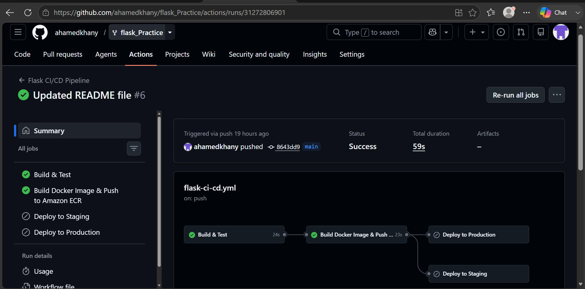


#### Workflow steps:

1.

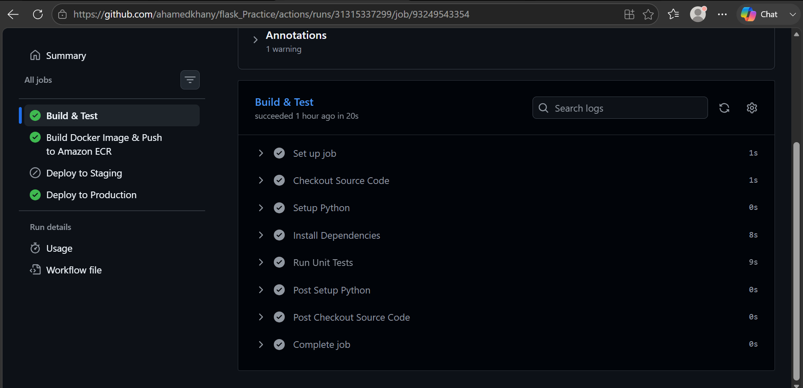

2.

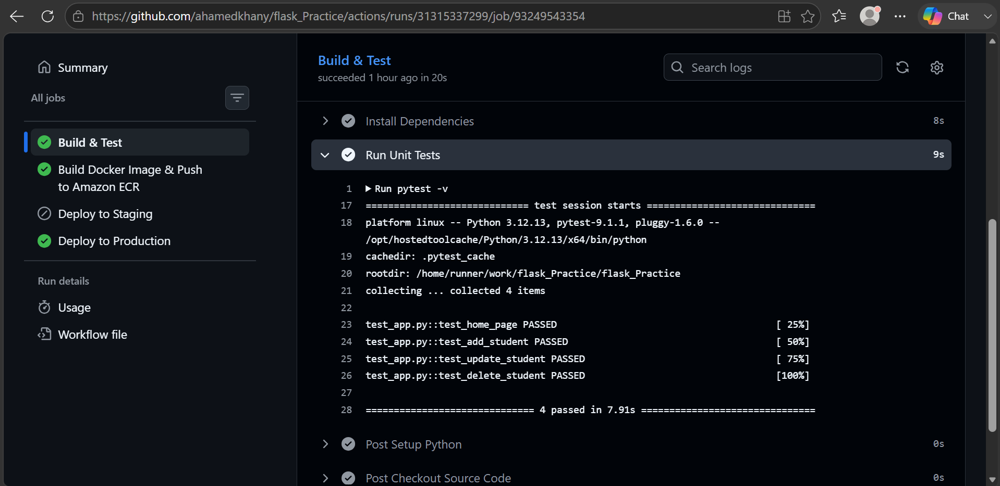

3.

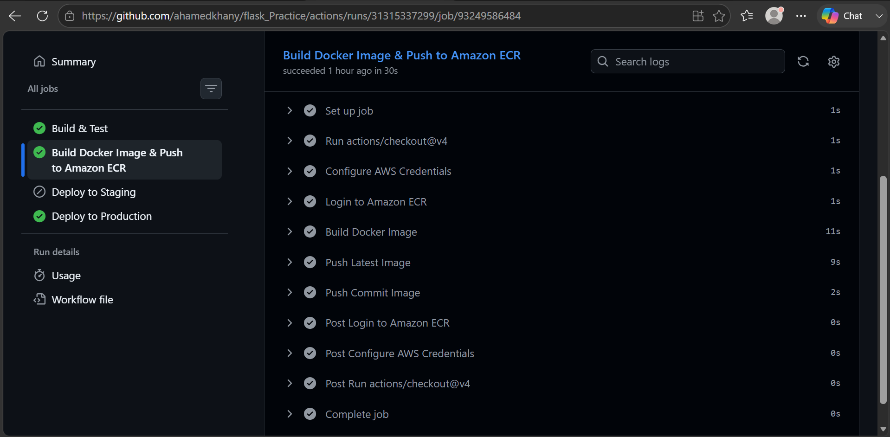

4.

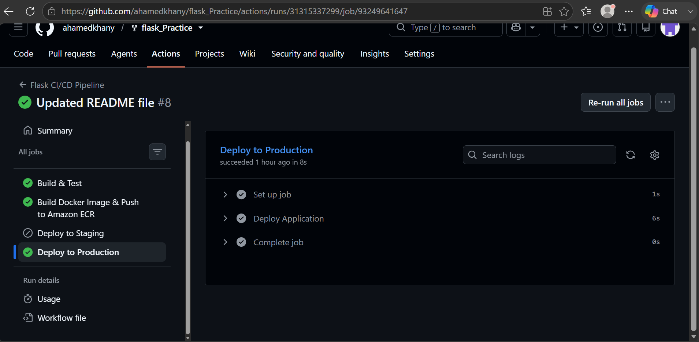


### Screenshot 2 — Staging Deployment

Show the successful staging workflow:

```text
✓ Build and Test
✓ Build and Push
✓ Deploy Staging
```

#### Code when pushed to staging branch:

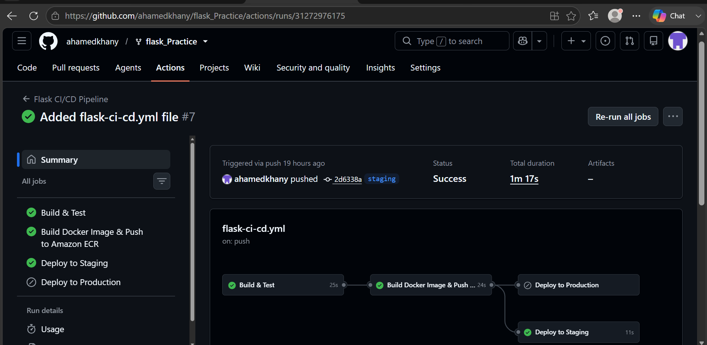

### Screenshot 3 — Production Deployment

Show:

```text
✓ Build and Test
✓ Build and Push
✓ Deploy Production
```

#### Code when pushed to main branch with tag:

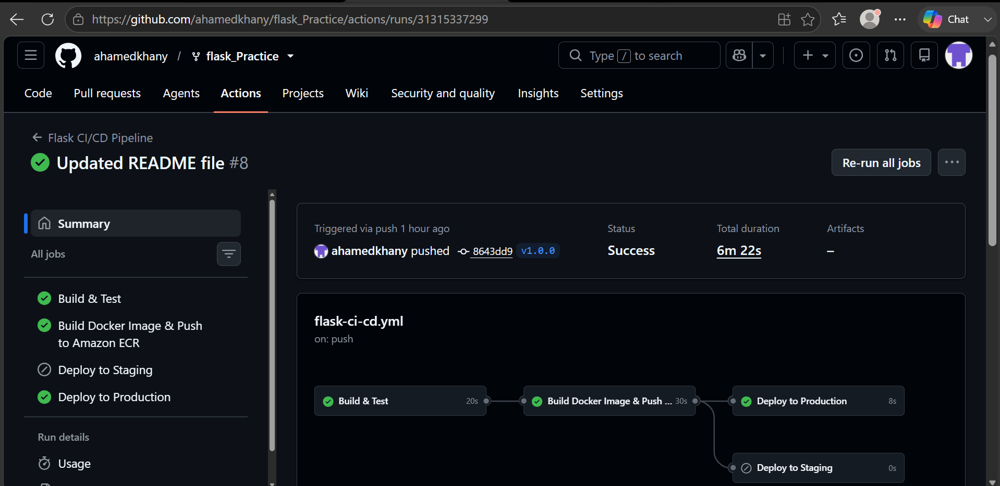


### Screenshot 4 — Amazon ECR

Show the `flask-app` repository and successfully pushed Docker image/tag.

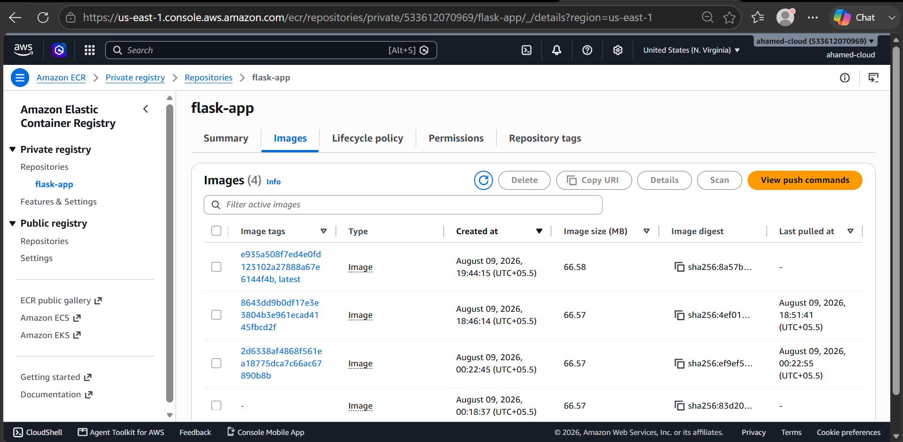


### Screenshot 5 — EC2 Docker Containers

Run:

```bash
docker ps
```

and capture the running staging and production containers.


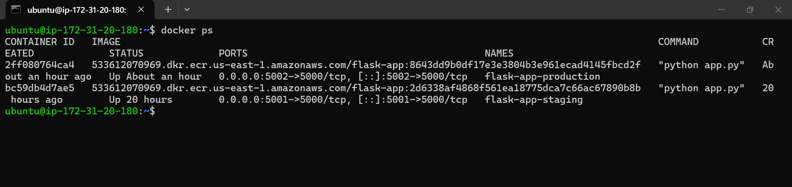


### Screenshot 6 — Application Test

Capture the Flask application successfully loading through:

```text
http://<EC2_PUBLIC_IP>:5001
```

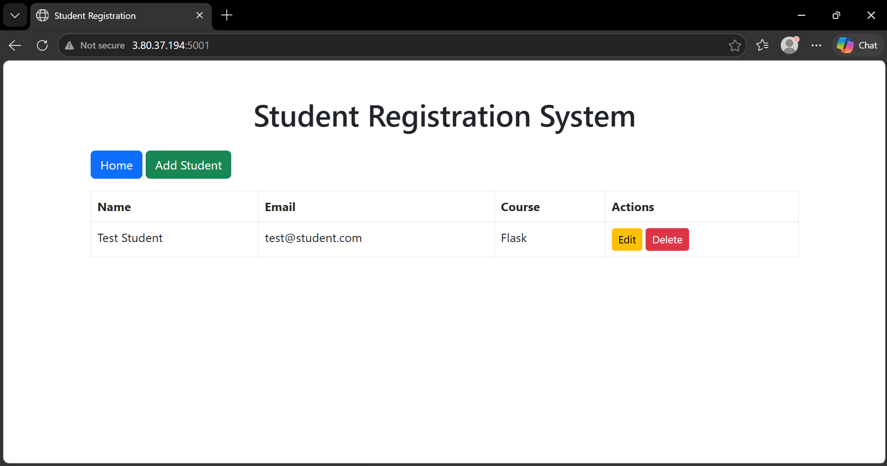


and:

```text
http://<EC2_PUBLIC_IP>:5002
```

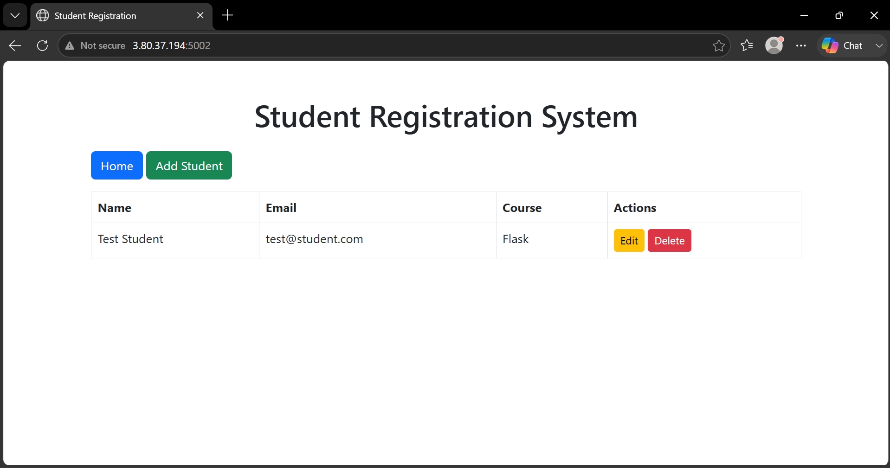


---

# 25. Final Result

The project successfully implements a complete CI/CD pipeline using:

```text
GitHub
   ↓
GitHub Actions
   ↓
Python Tests
   ↓
Docker Build
   ↓
Amazon ECR
   ↓
EC2
   ↓
Staging / Production
```

The implementation provides:

* Automated CI
* Automated Docker image builds
* Centralized Docker image storage using Amazon ECR
* Automated staging deployment
* Controlled production deployment
* GitHub Environment-based configuration
* Secure secret management
* Release-based production deployment
* Separate staging and production containers
* Deployment verification through Docker and browser testing
